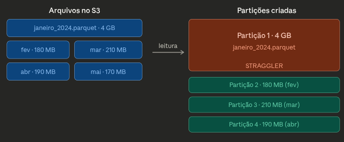
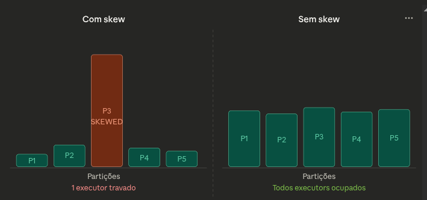
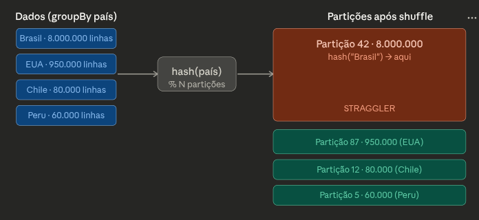

# NOTAS SOBRE SPARK

## 1) Lazy Evaluation

O Spark não faz nada quando você manda ele fazer filter(), select(), groupBy().

Tudo só é executado quando você chama uma *𝗮𝗰𝘁𝗶𝗼𝗻* como count(), show(), write().

O Spark olha tudo que você escreveu e antes de executar, o Catalyst Optimizer analisa o plano inteiro e decide a melhor forma de rodar. Ele pode reordenar filtros, eliminar colunas desnecessárias, combinar operações. Tudo antes de mover um byte de dado. Se o Spark executasse cada linha imediatamente, como um Pandas, você perderia todas essas otimizações.

Na prática isso significa:
- Escrever .filter() antes do .join() não é obrigatório — o Catalyst já faz isso por você
- Encadear várias transformações não custa nada — elas viram um único plano otimizado
- O custo real só aparece na action

## 2) Shuffle

Nem toda transformação no Spark custa igual: um filter / where, select / withColumn, map / flatMap, limit / sample, union e broadcast join lê a partição, aplica a transformação e pronto. Cada partição trabalha sozinha. Sem depender das outras. Sem conversa entre executores. Isso é uma *𝗻𝗮𝗿𝗿𝗼𝘄 𝘁𝗿𝗮𝗻𝘀𝗳𝗼𝗿𝗺𝗮𝘁𝗶𝗼𝗻*, são baratos, paralelizáveis, rápidos.

Obs: o broadcast join é a exceção interessante: é um join sem shuffle. O Spark copia a tabela menor inteira para todos os executors, então cada executor consegue fazer o join localmente com seu pedaço da tabela grande — sem precisar mover nenhum dado entre máquinas.

Quanto você tem groupBy, orderBy, distinct, join, repartition e window functions, o Spark precisa juntar dados de partições diferentes para agregar, ou seja, mover dados entre executores pela rede. Isso é uma *𝘄𝗶𝗱𝗲 𝘁𝗿𝗮𝗻𝘀𝗳𝗼𝗿𝗺𝗮𝘁𝗶𝗼𝗻* e gera *𝘀𝗵𝘂𝗳𝗳𝗹𝗲*.

Obs: Vale notar que o distinct e o window function surpreendem muita gente pois parecem operações simples, mas internamente fazem shuffle. O distinct é basicamente um groupBy em todas as colunas, e o window function precisa reagrupar os dados pela coluna do PARTITION BY.

O *𝘀𝗵𝘂𝗳𝗳𝗹𝗲* ocorre quando o Spark precisa redistribuir dados entre os nós do cluster. Para garantir que linhas com a mesma chave terminem no mesmo nó físico, o Spark realiza uma transferência intensa de dados pela rede. O shuffle exige etapas extremamente custosas para o hardware:
- Shuffle Write: Cada executor precisa escrever dados no disco para que outros possam lê-los.
- Shuffle Read: Os executores leem esses arquivos via rede.
- Serialização: Os dados precisam ser transformados em um formato transferível, consumindo CPU.
- Tráfego de Rede: O gargalo físico da comunicação entre as máquinas.

Antes de sair rodando qualquer transformação, é vital avaliar se aquela operação custosa é realmente necessária para o seu resultado final. Muitas vezes, um filtro aplicado mais cedo, remover um distinct desnecessário ou uma mudança na estratégia de particionamento pode evitar esse caos de leitura e escrita em disco.

**𝗤𝘂𝗮𝗻𝗱𝗼 𝗼 𝘀𝗵𝘂𝗳𝗳𝗹𝗲 𝘃𝗶𝗿𝗮 𝗽𝗿𝗼𝗯𝗹𝗲𝗺𝗮 𝗱𝗲 𝘃𝗲𝗿𝗱𝗮𝗱𝗲**:
- Shuffles desnecessários: distinct() onde não precisa, groupBy() em chaves de alta cardinalidade sem necessidade
- Shuffle sem controle de tamanho de partição: gera milhares de partições pequenas ou poucas partições gigantes
- Shuffle em dados desbalanceados: uma chave concentra 80% dos dados, um executor afoga enquanto os outros ficam ociosos (data skew)

**𝗤𝘂𝗮𝗻𝗱𝗼 𝗱𝗮 𝗽𝗿𝗮 𝗲𝘃𝗶𝘁𝗮𝗿**:
- Broadcast join quando uma das tabelas é pequena: o Spark manda a tabela inteira pra cada executor, sem mover a tabela grande
- Filtrar antes do join: menos dados pra redistribuir
- Usar o mesmo particionamento ao longo do pipeline

## 3) Skewness

*Sem shuffle, não tem skew*

O shuffle pode acontecer durante a leitura de dados inerentemente desbalanceados: não tem operação "errada" aqui — os dados simplesmente são assim. Quando o Spark lê dados do S3 (ou HDFS), ele cria uma partição por arquivo ou por bloco. Se os arquivos têm tamanhos muito diferentes, as partições já nascem desbalanceadas — antes de qualquer operação.



Agora, durante o processamento, o shuffle acontece quando você faz operações que precisam reagrupar dados entre executors. Nesse momento o Spark usa hash partitioning: pega a chave da operação, aplica um hash, e o resultado do hash determina em qual partição o registro vai. Cada executor pega uma partição por vez (por core disponível) e processa. Então se você tem 10 executors com 4 cores cada, você consegue processar 40 partições em paralelo simultaneamente. O *skewness* acontece quando os dados não estão distribuídos uniformemente entre as partições. Algumas tarefas ficam com muito mais dados que outras, causando um "stragglers problem" (a maioria dos executors termina rápido, mas um ou dois ficam travados processando partições enormes).



Aqui o Spark fez exatamente o que deveria — todos os "Brasil" precisam estar na mesma partição para poder agregar. O problema é que "Brasil" tem 8 milhões de linhas e os outros países têm muito menos.



**Causas**
- Joins com chaves muito populares: quando você faz um join, o Spark precisa colocar todas as linhas com a mesma chave na mesma partição para conseguir cruzar os dados. Se uma chave aparece milhões de vezes, aquela partição fica enorme.
- GroupBy em colunas de baixa cardinalidade: cardinalidade é o número de valores distintos de uma coluna. Uma coluna de baixa cardinalidade tem poucos valores possíveis — status com valores ativo/inativo, país com 5 opções, categoria com 10 valores. O problema é matemático: se você tem 200 partições mas apenas 5 valores distintos, no máximo 5 partições vão ter dados. As outras 195 ficam vazias. E das 5 que têm dados, a distribuição vai refletir a distribuição real dos valores — se 80% dos registros têm status = ativo, uma partição fica com 80% dos dados.
- Uso de collect() ou coalesce(1): Esses dois são diferentes dos anteriores — não causam skew nas partições distribuídas, mas causam um problema parecido: forçam todos os dados para um único ponto. collect() traz todos os dados do cluster para a memória do driver (a máquina que coordena o job). Se você fez isso no meio de um pipeline com um DataFrame grande, o driver pode explodir de memória — e mesmo que aguente, todo o paralelismo é perdido naquele momento. coalesce(1) reduz todas as partições para 1, forçando tudo para um único executor. É útil para gerar um único arquivo de saída, mas se usado cedo no pipeline, o resto do processamento roda em série num único core.

**Como descobrir**

Você pode diagnosticar olhando as métricas do Spark UI ou programaticamente:
```
from pyspark.sql import functions as F

df.groupBy(F.spark_partition_id()).count().orderBy("count", ascending=False).show(20)
```

**Como resolver**
- Adaptive Query Execution (AQE): o Spark rebalanceia as partições automaticamente em tempo de execução:
```
spark = SparkSession.builder \
    .config("spark.sql.adaptive.enabled", "true") \
    .config("spark.sql.adaptive.skewJoin.enabled", "true") \
    .config("spark.sql.adaptive.skewJoin.skewedPartitionFactor", "5") \
    .config("spark.sql.adaptive.skewJoin.skewedPartitionThresholdInBytes", "256mb") \
    .getOrCreate()
```
- Salting, para joins e groupBy: adiciona um número aleatório à chave para quebrar a partição gigante em N menores
```
import pyspark.sql.functions as F

N = 10  # fator de salting

# Tabela grande: adiciona salt aleatório
df_large = df_large.withColumn("salt", (F.rand() * N).cast("int"))
df_large = df_large.withColumn("salted_key", F.concat(F.col("join_key"), F.lit("_"), F.col("salt")))

# Tabela pequena: explode com todos os valores de salt
df_small = df_small.withColumn("salt", F.explode(F.array([F.lit(i) for i in range(N)])))
df_small = df_small.withColumn("salted_key", F.concat(F.col("join_key"), F.lit("_"), F.col("salt")))

result = df_large.join(df_small, "salted_key").drop("salt", "salted_key")
```
- Broadcast Join, quando uma tabela é pequena
```
spark.conf.set("spark.sql.autoBroadcastJoinThreshold", "50mb")

from pyspark.sql.functions import broadcast

result = df_large.join(broadcast(df_small), "join_key")
```
- Reparticionamento manual, quando souber de antemão qual coluna tem skew
```
# Reparticiona por uma coluna mais uniforme
df = df.repartition(200, "coluna_uniforme")

# Ou use repartitionByRange para dados ordenáveis
df = df.repartitionByRange(200, "data_coluna")
```
- Tratar valores nulos separadamente: chaves nulas tendem a colapsar numa única partição
```
df_nulls = df.filter(F.col("join_key").isNull())
df_valid = df.filter(F.col("join_key").isNotNull())

result_valid = df_valid.join(df_other, "join_key")
# Processa nulos separadamente conforme a lógica de negócio
result = result_valid.union(df_nulls)
```
